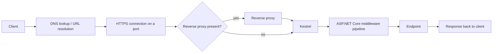
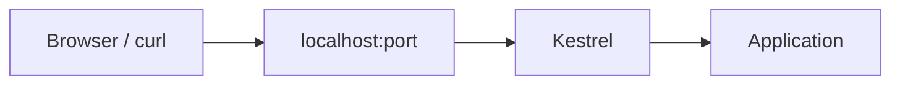

# .NET API Foundations: What Happens Before Day 1?

This is **Day 0** — a prerequisite refresher, not one of the 14 challenge days. Before tracing a request through the ASP.NET Core middleware pipeline on Day 1, I wanted to write down (and re-check against official docs) the fundamentals I'm assuming I already know. Some of this I use daily. Some of it I've never had to explain out loud. Writing it down in public is the point of this whole challenge.

If you already know all of this, skip ahead to [Day 1](day-01-request-pipeline-and-middleware.md) once it's published. If you're refreshing .NET like I am, hopefully this saves you some searching.

## Table of contents

1. [Why fundamentals matter in the AI era](#1-why-fundamentals-matter-in-the-ai-era)
2. [The .NET ecosystem: .NET, C#, ASP.NET Core, and the SDK](#2-the-net-ecosystem-net-c-aspnet-core-and-the-sdk)
3. [How .NET compares with Java](#3-how-net-compares-with-java)
4. [From C# source code to a running application](#4-from-c-source-code-to-a-running-application)
5. [What kinds of applications can .NET build?](#5-what-kinds-of-applications-can-net-build)
6. [What is an API?](#6-what-is-an-api)
7. [HTTP fundamentals](#7-http-fundamentals)
8. [What is a .NET server?](#8-what-is-a-net-server)
9. [How an HTTP request reaches an ASP.NET Core API](#9-how-an-http-request-reaches-an-aspnet-core-api)
10. [What is ASP.NET Core, and how do we create a Web API?](#10-what-is-aspnet-core-and-how-do-we-create-a-web-api)
11. [Understanding a Web API project structure](#11-understanding-a-web-api-project-structure)
12. [Minimal APIs, controllers, and architecture](#12-minimal-apis-controllers-and-architecture)
13. [What we will verify in this repository](#13-what-we-will-verify-in-this-repository)
14. [What comes next](#14-what-comes-next)
15. [Sources](#sources)

---

## 1. Why fundamentals matter in the AI era

AI can generate a working ASP.NET Core API in under a minute. That's not really in question anymore. What it can't do on its own is tell me whether that API is *correct*, *secure*, *fast enough*, *maintainable*, and actually *fit for the problem* I have. Those are judgment calls, and judgment needs a mental model to reason from.

Concretely, that means I want to be able to answer things like:

- **Correctness** — does this endpoint do what I think it does for every input, not just the happy path?
- **Security** — does this expose data it shouldn't, trust input it shouldn't, or skip a check an attacker could exploit?
- **Performance** — is this doing something needlessly expensive (blocking I/O, N+1 queries, over-fetching) that only shows up under load?
- **Maintainability** — will the next engineer (including future me) understand why this is structured this way?
- **Fit for purpose** — is this even the right tool? A minimal API endpoint and a full CQRS pipeline solve different problems.

None of that comes from prompting harder. It comes from understanding what the generated code is actually doing underneath — which is what this whole challenge is about.

So the learning loop for these 14 days is deliberately **AI + official docs + small experiments + tests**, used together rather than any one of them alone:

- **AI** to explain, scaffold, and unblock me quickly.
- **Official docs** (mostly Microsoft Learn) as the source of truth when AI's explanation and my intuition disagree.
- **Experiments** — actually running commands, inspecting output, poking at a real running API — because reading about behavior and observing it are different things.
- **Tests** as the thing that proves a piece of behavior, rather than just asserting it in a doc.

This document itself follows that loop: I used AI to structure it, cross-checked the factual claims against Microsoft Learn, and I'll verify the practical bits (project structure, DLLs, HTTP requests) hands-on starting Day 1.

## 2. The .NET ecosystem: .NET, C#, ASP.NET Core, and the SDK

These four terms get used almost interchangeably in casual conversation, but they mean different things:

| Term | What it actually is |
|---|---|
| **C#** | A programming language. You write C# source code (`.cs` files). |
| **.NET** | The free, open-source, cross-platform developer platform — the runtime, base class libraries, and language compilers that C# (and other .NET languages) run on. |
| **ASP.NET Core** | A web framework *built on top of* .NET, for building web apps and APIs. It's one of several "app stacks" .NET supports (others include Windows Forms, WPF, MAUI). |
| **.NET SDK** | The tooling — compilers, the `dotnet` CLI, project templates, NuGet client — used to create, build, test, run, and publish .NET projects. |

So the relationship is roughly: I write **C#**, the **.NET SDK** compiles and runs it, **.NET** is the platform that executes it, and **ASP.NET Core** is the specific framework I use when what I'm building is a web app or API.

Two commands are worth knowing before writing any code:

```bash
dotnet --info
```

Shows the installed SDK version, the runtime version(s) available, and details about the host OS/architecture. Useful for confirming exactly what's installed and which SDK a project will build against.

```bash
dotnet --list-sdks
```

Lists every .NET SDK version installed on the machine, one per line. Useful when multiple SDK versions are installed side by side and I need to know which one a `global.json` file (or the default) will pick up.

## 3. How .NET compares with Java

I use this comparison for orientation, not to declare a winner — both are mature, cross-platform backend ecosystems that plenty of large systems run on successfully. The actual architecture decisions (how you structure services, manage data, handle failure) matter far more to an application's success than which of these two you picked.

| Aspect | .NET | Java |
|---|---|---|
| Primary language | C# | Java |
| Runtime | CLR (Common Language Runtime) | JVM (Java Virtual Machine) |
| Intermediate code | IL (Intermediate Language) | Bytecode |
| Package/build tooling | NuGet + `dotnet` CLI / MSBuild | Maven or Gradle |
| Common web framework | ASP.NET Core | Spring Boot |
| Deployment | Self-contained or framework-dependent executables, containers | JAR/WAR files on a JVM, containers |
| Ecosystem | Microsoft-led, open source, strong Azure/Windows integration, growing cross-platform tooling | Community/Oracle/Apache-led, extremely broad enterprise ecosystem, mature on every cloud |

Both compile source into an intermediate representation (IL or bytecode) that their respective runtime JIT-compiles to native code at execution time — that's the conceptual parallel between CLR and JVM. Beyond that, the meaningful differences show up in tooling conventions and library ecosystems, not in some inherent superiority of one language.

## 4. From C# source code to a running application

The flow from code I write to a process actually running looks like this:

```text
C# source files (.cs)
        │  dotnet build
        ▼
   Assembly (.dll)
        │  loaded by
        ▼
   .NET runtime (CLR)
        │  JIT-compiles IL to native code, executes it
        ▼
   Running process
```

A **DLL** in .NET is an *assembly* — a compiled unit that bundles IL code, metadata describing its types, and a manifest listing which other assemblies it depends on. Assemblies are the fundamental unit of deployment and versioning in .NET; the runtime uses the metadata to resolve types and load dependencies at run time. An assembly can be a library DLL or, for an app, the entry-point assembly the runtime starts executing.

Depending on the OS and how the project is built or published, there may *also* be a native executable host alongside the DLL (for example, an `.exe` on Windows, or an apphost binary on Linux/macOS) that exists purely to launch the .NET runtime and load the app's DLL — the actual application code still lives in the DLL either way.

> **Verification exercise (do this after Day 1, once a project exists):**
> Run `dotnet build`, then look inside `bin/Debug/<target-framework>/` (e.g. `bin/Debug/net9.0/`). Identify:
> - The application's own DLL (named after the project)
> - The dependency DLLs it references (NuGet packages, shared framework references)
> - Whether an executable host is present for your OS

## 5. What kinds of applications can .NET build?

.NET is a general-purpose platform — ASP.NET Core (web APIs) is just one of several app stacks built on it:

| Application type | What it's for |
|---|---|
| Console app | Command-line tools and scripts |
| Class library | Reusable code shared across other .NET projects |
| ASP.NET Core web app / API | Web sites and HTTP APIs — what this repository focuses on |
| Worker service | Long-running background processes (queues, scheduled jobs) |
| Desktop app (WPF / Windows Forms) | Windows desktop applications |
| Mobile / cross-platform app (.NET MAUI) | iOS, Android, and desktop apps from one codebase |
| Game development (Unity) | Games, using C# as the scripting language over the Unity engine |

Everything from here on focuses specifically on **ASP.NET Core Web APIs**, since that's the application type this repository builds toward.

## 6. What is an API?

In plain terms: an **API (Application Programming Interface)** is a defined way for one piece of software to ask another piece of software to do something or return some data, without needing to know how that other piece is implemented internally.

A **Web API** is an API exposed over HTTP: a server listens for HTTP requests, and clients (browsers, mobile apps, other services, `curl`, a React frontend) send requests to it and get back responses — commonly formatted as JSON.

Concrete example: a React frontend needs a user's task list, so it sends:

```text
GET /api/tasks
```

The API receives that request, looks up the tasks (probably from a database), and responds with something like:

```json
[
  { "id": 1, "title": "Write Day 0 notes", "done": true },
  { "id": 2, "title": "Scaffold the API project", "done": false }
]
```

The React app never needs to know how the server fetched that data — just the contract: send a `GET` to `/api/tasks`, get JSON back.

## 7. HTTP fundamentals

A few pieces come up in almost every API interaction:

- **URL** — the address of a resource, e.g. `https://api.example.com/api/tasks/2`.
- **HTTP method** — what kind of action the request represents:
  - `GET` — retrieve a resource
  - `POST` — create a resource
  - `PUT` — replace a resource
  - `PATCH` — partially update a resource
  - `DELETE` — remove a resource
- **Headers** — key/value metadata sent with the request or response (e.g. `Content-Type`, `Authorization`).
- **Body** — the payload of the request or response (often JSON for APIs).
- **Status code** — a three-digit number in the response indicating the outcome (`200` OK, `201` Created, `400` Bad Request, `401` Unauthorized, `404` Not Found, `500` Internal Server Error).
- **JSON** — the common text format for structuring request/response bodies in modern web APIs.
- **Port** — the numeric endpoint a server listens on for a given host (e.g. `:443` for HTTPS, `:5001` for a local dev API).
- **HTTPS vs HTTP** — HTTPS is HTTP layered over TLS, encrypting traffic between client and server. Plain HTTP sends everything in the clear. Production APIs should use HTTPS; ASP.NET Core's local dev templates set up HTTPS by default even for `localhost`.

An annotated request/response pair for the example above:

```text
GET /api/tasks/2 HTTP/1.1          ← method, path, HTTP version
Host: api.example.com              ← which server to route to
Accept: application/json           ← "I want JSON back"
Authorization: Bearer <token>      ← auth credential, if required
```

```text
HTTP/1.1 200 OK                    ← status line: success
Content-Type: application/json     ← body format

{
  "id": 2,
  "title": "Scaffold the API project",
  "done": false
}
```

**Not runnable yet — this needs an actual running API (Day 1+):**

```bash
curl -i https://localhost:5001/api/tasks
```

`-i` includes the response headers and status line, which is useful for seeing exactly what came back, not just the body.

## 8. What is a .NET server?

"A .NET server" isn't a separate product you install — it usually just means **a running ASP.NET Core application process that is listening for HTTP requests**. The "server" is the app itself, plus the web server component embedded in it.

That embedded component is **Kestrel** — ASP.NET Core's cross-platform HTTP server, included by default in every ASP.NET Core project. Kestrel is what actually accepts TCP connections and parses HTTP requests before handing them to the application.

A few related concepts at a high level, without going deep yet:

- **localhost** — the loopback address for "this machine," used during local development so the API is only reachable from the same computer.
- **Port** — the number Kestrel binds to and listens on (e.g. `5001`); multiple processes on one machine each need their own port.
- **Reverse proxy** — in production, Kestrel often sits behind another server (like NGINX or IIS, or a cloud load balancer) that handles things like TLS termination, load balancing, or serving multiple apps behind one public address, and forwards requests to Kestrel.
- **Cloud infrastructure** — in a cloud deployment, there's typically a load balancer or gateway in front of the reverse proxy/Kestrel layer, but the same fundamentals apply: something accepts the public connection, and it's ultimately routed to a Kestrel process running the app.

*How Kestrel decides what to do with a request once it has one — the middleware pipeline — is deliberately not covered here. That's Day 1.*

## 9. How an HTTP request reaches an ASP.NET Core API

The general path, including the pieces that may or may not be present depending on the deployment:



For **local development**, most of that collapses to a much shorter path — no DNS, no reverse proxy, just the loopback address straight to Kestrel:



*The middleware pipeline and endpoint routing boxes above are placeholders for now — Day 1 opens them up and traces exactly what happens inside.*

## 10. What is ASP.NET Core, and how do we create a Web API?

**ASP.NET Core** is .NET's cross-platform, open-source framework for building web apps and APIs — it's what sits on top of Kestrel and everything else described above, providing routing, middleware, dependency injection, configuration, and the other pieces an API needs.

**Not run yet — this is the command that will scaffold the API in a later day:**

```bash
dotnet new webapi -n DotnetApiFundamentals.Api
```

At a high level, this command generates a new project directory containing:

- A project file (`.csproj`) describing the target framework and dependencies
- `Program.cs`, the application's entry point and configuration
- `appsettings.json` / `appsettings.Development.json` for configuration
- `Properties/launchSettings.json` describing how to run the app locally (ports, environment)
- A starter minimal-API endpoint to confirm the template runs

The same project can also be created through **Visual Studio** (File → New Project → ASP.NET Core Web API) or **VS Code** (via the same `dotnet new` command run from its integrated terminal, or the C# Dev Kit's project creation UI) — they all produce the same underlying template.

No generated project files are added to this repository as part of this Day 0 document — that happens when the API is actually scaffolded.

## 11. Understanding a Web API project structure

A freshly generated ASP.NET Core Web API project typically looks like this:

```text
DotnetApiFundamentals.Api/
├── Program.cs                          # entry point + app configuration
├── appsettings.json                    # base configuration
├── appsettings.Development.json        # dev-environment overrides
├── Properties/
│   └── launchSettings.json             # local run profiles (ports, env vars)
├── DotnetApiFundamentals.Api.csproj    # project file: target framework, packages
├── bin/                                # generated build output — do not commit
└── obj/                                # generated intermediate build files — do not commit
```

`bin/` and `obj/` are regenerated every time the project builds — they hold compiled output and intermediate build artifacts respectively, and belong in `.gitignore`, not in source control.

Beyond that starter layout, folder organization is flexible. A small API might keep everything in a handful of files; a larger one might grow `Models/`, `Services/`, `Data/` folders or a full layered structure. The template gives a starting point, not a mandate — structure should evolve as the application's actual complexity demands it, which section 12 gets into.

## 12. Minimal APIs, controllers, and architecture

These terms get conflated a lot, but they answer different questions:

| Concept | What it actually answers |
|---|---|
| **Minimal APIs** | *How do I define an endpoint?* — An ASP.NET Core style where routes and handlers are declared directly (often in `Program.cs` or via extension methods), without a controller class. |
| **Controllers** | *How do I define an endpoint?* — The MVC-style approach: endpoints are actions (methods) on controller classes, grouped by resource. |
| **Three-tier architecture** | *How is the whole application organized?* — A broad architectural split into presentation/API, business/application logic, and data access layers. |
| **Clean Architecture** | *How is the whole application organized?* — A related architectural approach emphasizing dependency direction (inner layers know nothing about outer ones) and clear domain boundaries. |
| **Design patterns** | *How do I solve this specific code-level problem?* — Reusable solutions to recurring design problems (e.g. Repository, Factory, Strategy). Not an application architecture by themselves. |

Minimal APIs and controllers are both just ways of *declaring endpoints* — they're an endpoint-definition style choice, not an architecture:

| | Minimal APIs | Controllers |
|---|---|---|
| Where endpoints live | `Program.cs` or extension methods | Controller classes with action methods |
| Typical use case | Small APIs, microservices, simpler surface area | Larger APIs, especially ones already using MVC conventions |
| Boilerplate | Less — no controller class required | More structure out of the box (attributes, base class helpers) |
| Filters / model binding / routing | Fully supported | Fully supported |
| Grouping related endpoints | `MapGroup` and extension methods | Naturally grouped by controller class |

Choosing Minimal APIs does **not** prevent using a layered or Clean Architecture underneath — the endpoint style and the application's internal structure are separate decisions. A Minimal API endpoint can still call into a well-separated service/business layer and a distinct data-access layer; it just skips the controller class as an organizing unit.

For this repository, the plan is to start with whatever's simplest (very likely Minimal APIs, since the template defaults to them) and introduce more structure only when a real complexity problem shows up — not preemptively.

## 13. What we will verify in this repository

This document is notes and definitions — the following is what still needs to be checked hands-on, starting Day 1. None of this is done yet:

- [ ] Inspect the generated DLL(s) after `dotnet build` and identify app vs. dependency DLLs
- [ ] Send real HTTP requests to a running API using `curl` or a REST client
- [ ] Observe the local port and running process for the API
- [ ] Run a middleware experiment (Day 1)
- [ ] Inspect application logs
- [ ] Write tests that actually prove the described behavior, rather than just asserting it here

## 14. What comes next

[Day 1](day-01-request-pipeline-and-middleware.md) will trace a request through the ASP.NET Core middleware pipeline — the part of section 9's diagram left as a placeholder.

---

## Sources

- [Introduction to .NET](https://learn.microsoft.com/en-us/dotnet/core/introduction) — what .NET is, its components (runtime, libraries, compiler, SDK, app stacks)
- [C# documentation](https://learn.microsoft.com/en-us/dotnet/csharp/) — the C# language
- [Overview of ASP.NET Core](https://learn.microsoft.com/en-us/aspnet/core/introduction-to-aspnet-core) — what ASP.NET Core is and its key features
- [.NET CLI overview](https://learn.microsoft.com/en-us/dotnet/core/tools/) — the `dotnet` command-line tooling
- [Assemblies in .NET](https://learn.microsoft.com/en-us/dotnet/standard/assembly/) — what an assembly/DLL is
- [Kestrel web server in ASP.NET Core](https://learn.microsoft.com/en-us/aspnet/core/fundamentals/servers/kestrel) — the embedded cross-platform web server
- [ASP.NET Core Middleware](https://learn.microsoft.com/en-us/aspnet/core/fundamentals/middleware/) — the pipeline covered in depth on Day 1
- [Tutorial: Create a minimal API with ASP.NET Core](https://learn.microsoft.com/en-us/aspnet/core/tutorials/min-web-api) — `dotnet new webapi` and Minimal APIs
- [Handle requests with controllers in ASP.NET Core MVC](https://learn.microsoft.com/en-us/aspnet/core/mvc/controllers/actions) — the controller-based alternative
- [HTTP request and response messages in ASP.NET Core web APIs](https://learn.microsoft.com/en-us/aspnet/core/web-api/) — HTTP fundamentals in an ASP.NET Core context
