# Day 1 — .NET API Foundations: Fundamentals, Kestrel, TLS, and Reverse Proxies

This is **Day 1** of the challenge. Before tracing a request through the ASP.NET Core middleware pipeline on Day 2, I wanted to write down (and re-check against official docs) the fundamentals I'm assuming I already know. Some of this I use daily. Some of it I've never had to explain out loud. Writing it down in public is the point of this whole challenge.

If you already know all of this, skip ahead to [Day 2](day-02-request-pipeline-and-middleware.md) once it's published. If you're refreshing .NET like I am, hopefully this saves you some searching.

> A few of the examples below (file listings, exact sizes, a scratch Web API's generated structure) come from small throwaway projects built and inspected on my own machine while writing this — not committed to the repo, just experiments run to verify the claims rather than assume them.

## Table of contents

1. [Why fundamentals matter in the AI era](#1-why-fundamentals-matter-in-the-ai-era)
2. [The .NET ecosystem: .NET, C#, ASP.NET Core, and the SDK](#2-the-net-ecosystem-net-c-aspnet-core-and-the-sdk)
   - [2.1 What the SDK does vs. what the runtime does](#21-what-the-sdk-does-vs-what-the-runtime-does)
3. [How .NET compares with Java](#3-how-net-compares-with-java)
   - [3.1 .cs, IL, and native code: keeping the three straight](#31-cs-il-and-native-code-keeping-the-three-straight)
   - [3.2 Self-contained vs. framework-dependent vs. containers](#32-self-contained-vs-framework-dependent-vs-containers)
   - [3.3 `dotnet build` vs. `dotnet publish`, and how hosting actually works](#33-dotnet-build-vs-dotnet-publish-and-how-hosting-actually-works)
4. [From C# source code to a running application](#4-from-c-source-code-to-a-running-application)
   - [4.1 A worked example: one file, three stages](#41-a-worked-example-one-file-three-stages)
   - [4.2 DLL vs EXE, and where each one comes from](#42-dll-vs-exe-and-where-each-one-comes-from)
5. [What kinds of applications can .NET build?](#5-what-kinds-of-applications-can-net-build)
6. [What is an API?](#6-what-is-an-api)
   - [6.1 A non-web API, for contrast](#61-a-non-web-api-for-contrast)
7. [HTTP fundamentals](#7-http-fundamentals)
   - [7.1 Why HTTPS needs a certificate](#71-why-https-needs-a-certificate)
8. [What is a .NET server?](#8-what-is-a-net-server)
   - [8.1 HTTP rides on top of TCP](#81-http-rides-on-top-of-tcp)
   - [8.2 Kestrel, in one sentence first](#82-kestrel-in-one-sentence-first)
   - [8.3 Reverse proxies: the simple picture, then Nginx and IIS](#83-reverse-proxies-the-simple-picture-then-nginx-and-iis)
   - [8.4 Cloud load balancers](#84-cloud-load-balancers)
   - [8.5 Putting it together](#85-putting-it-together)
9. [How an HTTP request reaches an ASP.NET Core API](#9-how-an-http-request-reaches-an-aspnet-core-api)
10. [What is ASP.NET Core, and how do we create a Web API?](#10-what-is-aspnet-core-and-how-do-we-create-a-web-api)
    - [10.1 Where routing, middleware, DI, and configuration sit on top of Kestrel](#101-where-routing-middleware-di-and-configuration-sit-on-top-of-kestrel)
11. [Understanding a Web API project structure](#11-understanding-a-web-api-project-structure)
12. [Minimal APIs, controllers, and architecture](#12-minimal-apis-controllers-and-architecture)
13. [Follow-up questions: TLS handshakes, reverse proxies, and load balancers](#13-follow-up-questions-tls-handshakes-reverse-proxies-and-load-balancers)
    - [13.1 The TLS handshake, step by step](#131-the-tls-handshake-step-by-step)
    - [13.2 Why the reverse proxy can't hand the connection off to Kestrel](#132-why-the-reverse-proxy-cant-hand-the-connection-off-to-kestrel)
    - [13.3 Forward proxy vs. reverse proxy](#133-forward-proxy-vs-reverse-proxy)
    - [13.4 Load-balancer strategies: it's not just RAM](#134-load-balancer-strategies-its-not-just-ram)
    - [13.5 Try it yourself: two Kestrel instances behind Nginx](#135-try-it-yourself-two-kestrel-instances-behind-nginx)
14. [What we will verify in this repository](#14-what-we-will-verify-in-this-repository)
15. [What comes next](#15-what-comes-next)
16. [Sources](#sources)

---

## 1. Why fundamentals matter in the AI era

AI can generate a working ASP.NET Core API in under a minute. That's not really in question anymore. What it can't do on its own is tell me whether that API is *correct*, *secure*, *fast enough*, *maintainable*, and actually *fit for the problem* I have. Those are judgment calls, and judgment needs a mental model to reason from.

Concretely, that means I want to be able to answer things like:

- **Correctness** — does this endpoint do what I think it does for every input, not just the happy path?
- **Security** — does this expose data it shouldn't, trust input it shouldn't, or skip a check an attacker could exploit?
- **Performance** — is this doing something needlessly expensive (blocking I/O, N+1 queries, over-fetching) that only shows up under load?
- **Maintainability** — will the next engineer (including future me) understand why this is structured this way?
- **Fit for purpose** — is this even the right tool? A minimal API endpoint and a full CQRS pipeline solve different problems.

None of that comes from prompting harder. It comes from understanding what the generated code is actually doing underneath — which is what this whole challenge is about.

So the learning loop for these 14 days is deliberately **AI + official docs + small experiments + tests**, used together rather than any one of them alone:

- **AI** to explain, scaffold, and unblock me quickly.
- **Official docs** (mostly Microsoft Learn) as the source of truth when AI's explanation and my intuition disagree.
- **Experiments** — actually running commands, inspecting output, poking at a real running API — because reading about behavior and observing it are different things.
- **Tests** as the thing that proves a piece of behavior, rather than just asserting it in a doc.

This document itself follows that loop: I used AI to structure it, cross-checked the factual claims against Microsoft Learn, and I verified the practical bits (project structure, DLLs, the Nginx load-balancing demo) hands-on rather than just describing them — with the remaining HTTP-request checks continuing from Day 2 onward.

## 2. The .NET ecosystem: .NET, C#, ASP.NET Core, and the SDK

These four terms get used almost interchangeably in casual conversation, but they mean different things:

| Term | What it actually is |
|---|---|
| **C#** | A programming language. You write C# source code (`.cs` files). |
| **.NET** | The free, open-source, cross-platform developer platform — the runtime, base class libraries, and language compilers that C# (and other .NET languages) run on. |
| **ASP.NET Core** | A web framework *built on top of* .NET, for building web apps and APIs. It's one of several "app stacks" .NET supports (others include Windows Forms, WPF, MAUI). |
| **.NET SDK** | The tooling — compilers, the `dotnet` CLI, project templates, NuGet client — used to create, build, test, run, and publish .NET projects. |

So the relationship is roughly: I write **C#**, the **.NET SDK** compiles and runs it, **.NET** is the platform that executes it, and **ASP.NET Core** is the specific framework I use when what I'm building is a web app or API.

Two commands are worth knowing before writing any code:

```bash
dotnet --info
```

Shows the installed SDK version, the runtime version(s) available, and details about the host OS/architecture. Useful for confirming exactly what's installed and which SDK a project will build against.

```bash
dotnet --list-sdks
```

Lists every .NET SDK version installed on the machine, one per line. Useful when multiple SDK versions are installed side by side and I need to know which one a `global.json` file (or the default) will pick up.

### 2.1 What the SDK does vs. what the runtime does

"The SDK builds and runs the app" and "the runtime executes it" can sound like they're describing the same thing twice. They're not — but the reason they sound that way is that "the SDK" is used to mean two different things, and it's worth separating them explicitly.

As a **responsibility**, the SDK's job really is just compiling: it takes `.cs` files and produces a compiled assembly (a `.dll`) on disk. Nothing runs during that step — building is purely a translation step. Executing that assembly — managing memory, JIT-compiling the code, enforcing type safety — is entirely the **runtime**'s (the CLR's) job, a separate concern from compiling.

As an **installed package**, however, "the .NET SDK" is a superset: Microsoft ships it bundled together with a full copy of the runtime too, purely for developer convenience, so one install lets a developer both build and run apps locally without a second install. That bundling is *why* installing the SDK also lets `dotnet run` work immediately — but the two halves inside that one package still don't share a job. The compiler/MSBuild half only ever compiles; the runtime half is the only part that ever executes anything, exactly as before.

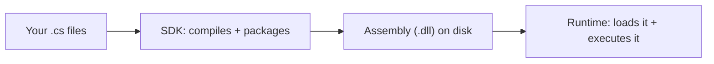

(What "compiles" and "executes" actually mean at the IL/JIT level is section 3.1 and section 4's job — this diagram is only about *which component is responsible for which phase*.)

This split is also why the single `dotnet` command can mean different things depending on what's installed. `dotnet` is one executable — Microsoft calls it "the muxer" — that behaves differently depending on what's present on the machine. A **Runtime-only** install still provides a `dotnet` executable, but a stripped-down one: it can only run an already-built app (`dotnet myapp.dll`), since there's no compiler behind it. An **SDK** install provides the same `dotnet` executable, now backed by the full toolset (Roslyn, MSBuild, NuGet client) plus its own bundled runtime — so it can additionally `build`, `test`, `new`, and `publish`. This matches Microsoft's own install documentation, which ships genuinely separate installers for ".NET Runtime", ".NET Desktop Runtime", "ASP.NET Core Runtime", and ".NET SDK" (a superset of all three, plus tooling):

| Installed | `dotnet myapp.dll` works? | `dotnet build` / `dotnet new` work? |
|---|---|---|
| .NET Runtime only | Yes | No — these need the compiler/MSBuild, which ship only with the SDK |
| .NET SDK | Yes (using its bundled runtime) | Yes |

A production server running a framework-dependent app therefore only needs the **Runtime** installer, never the SDK — it only ever needs to execute an already-compiled DLL, never to compile one.

**What NuGet actually is.** A NuGet package usually *is* a smaller, already-compiled piece of .NET code — typically one or more `.dll` files, plus a manifest describing its version and its own dependencies — packaged into a single `.nupkg` file and published to a registry (nuget.org by default). The **NuGet client** (built into the `dotnet` CLI and MSBuild) is the tool that downloads those packages during `dotnet restore` (which `dotnet build` runs automatically) and adds their DLLs as references your project compiles against. NuGet itself never *runs* anything — it's purely a fetch-and-reference step at build time, the same role `npm install` plays for a JS project or `pip install` for Python. Once restored, a package's DLL sits right alongside your own app's DLL in the build output, and the CLR loads and runs both of them exactly the same way — the CLR doesn't know or care whether a DLL was compiled by you or downloaded as a package. (I saw this directly while testing for this doc: scaffolding a Web API added a `Microsoft.AspNetCore.OpenApi` NuGet reference to the `.csproj`, and after building, `Microsoft.AspNetCore.OpenApi.dll` and `Microsoft.OpenApi.dll` showed up in `bin/Debug/` right next to the app's own DLL.)

## 3. How .NET compares with Java

I use this comparison for orientation, not to declare a winner — both are mature, cross-platform backend ecosystems that plenty of large systems run on successfully. The actual architecture decisions (how you structure services, manage data, handle failure) matter far more to an application's success than which of these two you picked.

| Aspect | .NET | Java |
|---|---|---|
| Primary language | C# | Java |
| Runtime | CLR (Common Language Runtime) | JVM (Java Virtual Machine) |
| Intermediate code | IL (Intermediate Language) | Bytecode |
| Package/build tooling | NuGet + `dotnet` CLI / MSBuild | Maven or Gradle |
| Common web framework | ASP.NET Core | Spring Boot |
| Deployment | Self-contained or framework-dependent executables, containers | JAR/WAR files on a JVM, containers |
| Ecosystem | Microsoft-led, open source, strong Azure/Windows integration, growing cross-platform tooling | Community/Oracle/Apache-led, extremely broad enterprise ecosystem, mature on every cloud |

Both compile source into an intermediate representation (IL or bytecode) that their respective runtime JIT-compiles to native code at execution time — that's the conceptual parallel between CLR and JVM. Beyond that, the meaningful differences show up in tooling conventions and library ecosystems, not in some inherent superiority of one language.

One common assumption worth correcting here: "the JVM only runs Java, while the CLR runs C# and others" — as if only the CLR were multi-language. That's not quite right. Both are **managed runtimes** (your code doesn't talk to the CPU/OS directly — it runs inside a virtual execution engine providing garbage collection and type safety), and both host more than one language: the CLR runs C#, F#, and VB.NET; the JVM, despite being synonymous with Java, also runs Kotlin and Scala, because they compile to the same bytecode format. "One runtime, many languages" isn't a .NET-only idea — it's just more front-and-center in how Microsoft names things (*Common* Language Runtime).

### 3.1 .cs, IL, and native code: keeping the three straight

This was the actual source of my confusion, and I don't think more paragraphs would have fixed it — I needed to see the three things next to each other and know exactly where each one physically lives.

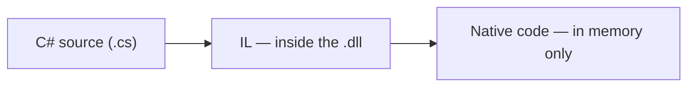

| Thing | What it is | Where it physically lives |
|---|---|---|
| C# source | Human-written code | `.cs` files, in your project |
| **IL** (also CIL / MSIL) | CPU-independent instructions — the compiler's *real* output | Packed inside the `.dll` file, on disk. **IL and the DLL are not the same thing — IL is the content, the `.dll` is the container it's shipped in.** |
| **Native machine code** | The actual CPU-specific instructions your processor executes directly — no further translation needed | Generated by the JIT compiler *at run time*, kept only in memory, method by method, the first time each method is called. It is never written back into the `.dll`. |

So: the compiler never produces native code directly. It produces IL, and IL rides inside the `.dll`. Only when the CLR actually runs your app does the JIT convert that IL into real, final, CPU-native bytes — and that conversion happens in memory, on the fly, not as a separate build step you'd ever see as a file. That's also the direct answer to "is native code the end bytes the computer understands" — yes, that's the literal end of the chain; there's nothing beneath native code except the CPU itself.

Java's version of this is the same shape, different names: `.java` → `javac` → bytecode (inside a `.class`, typically bundled into a `.jar`) → JVM's own JIT → native code in memory. Same three-link chain, same reason it exists: bytecode/IL is portable across machines; only the final JIT step is specific to the CPU actually running it.

### 3.2 Self-contained vs. framework-dependent vs. containers

This connects straight back to section 2.1: whether a deployment target needs the .NET *runtime* pre-installed depends entirely on which of these publishing modes you use.

- **Framework-dependent** (the default) — ship just your app's compiled code plus a small native launcher. The target machine must already have a matching .NET runtime installed.
- **Self-contained** — ship your app's code *and* a full copy of the .NET runtime it needs. The target machine needs nothing pre-installed.
- **Containers** — package the app (built either way above) together with a minimal OS layer into one portable image, run by a container engine like Docker, regardless of what's on the host.

**Which one do people actually reach for?** In practice: **framework-dependent** is the default and the overwhelming majority case — most hosting environments (a VM you control, a PaaS like AWS Elastic Beanstalk or Azure App Service) let you install or pre-select the .NET runtime once, so there's no reason to pay the size cost of bundling it into every deployment. **Self-contained** shows up when you *don't* control the target environment at all — shipping a CLI tool to end users' machines, or a constrained execution environment (some AWS Lambda custom-runtime setups) where you can't guarantee any .NET version is pre-installed. **Containers** have become the default choice for most professional/production deployments *regardless* of self-contained vs. framework-dependent, because the container solves a different, bigger problem than either mode does on its own — the next few paragraphs are about why.

| Mode | What's shipped | Target machine needs | Real size, from a one-file console app I actually published both ways |
|---|---|---|---|
| Framework-dependent | App DLL + native launcher | A matching .NET runtime, pre-installed | **152 KB** |
| Self-contained | App DLL + launcher + full .NET runtime (~190 files) | Nothing but the OS itself | **83 MB** |
| Container | App (either mode above) + OS layer, as one image | A container runtime (e.g. Docker) | Similar to whichever mode is inside it, plus a base-image layer |

**What a container actually is, and why it exists.** A container is a running process that's been bundled together with everything it needs to run — its code, its runtime, its system libraries, its configuration — into an isolated little world that behaves identically no matter what machine it's actually running on. The blueprint for that bundle is called an **image**: a read-only template built from a `Dockerfile`, where each instruction in the file (`FROM`, `COPY`, `RUN`, …) adds one layer on top of the last, and the final image is just that stack of layers. The relationship between an **image** and a **container** is the same relationship as an assembly and a running process from section 4 — the image is the thing sitting on disk; a container is one *running instance* of that image, the same way a process is one running instance of a `.dll`. You can start several containers from the same image at once, just like you can run the same `.dll` as several separate processes.

**Why bother, when self-contained deployment already bundles the runtime?** Self-contained solves "does this machine have .NET installed" — it says nothing about the rest of the environment: OS package versions, environment variables, conflicting software, file-system layout, network configuration. A container image bundles a *minimal OS layer* too, so "works on my machine" stops being a meaningful sentence — if it runs in the image, it runs identically anywhere that image runs, dev laptop or production cluster. That's the whole "works on my machine" problem containers exist to close.

**How you'd actually use one, concretely:** you build an image once (`dotnet publish -t:PublishContainer`, or a `Dockerfile`), push it to a registry (Docker Hub, AWS ECR, Azure Container Registry — the same idea as NuGet, but for images instead of DLLs), and then a container runtime somewhere pulls that exact image and runs it. Day 12 of this challenge is where I'll actually do this end-to-end, rather than just describe it.

**How these three actually get hosted, in practice** (vocabulary for now — Day 13 covers AWS deployment hands-on):

- **Framework-dependent** → a VM/EC2 instance or PaaS (AWS Elastic Beanstalk, Azure App Service) where the platform provides a pre-installed .NET runtime; you deploy just your small published output onto it.
- **Self-contained** → a bare compute environment with no assumptions about what's installed — a minimal EC2 instance, an AWS Lambda custom runtime, or handing a binary directly to someone.
- **Container** → pushed to a registry (ECR/ACR/Docker Hub), then run by a container orchestrator: AWS ECS/Fargate, EKS (Kubernetes), Azure Container Apps. This is the dominant pattern for production services today, independent of whether the image itself is self-contained or framework-dependent inside.

**Not runnable yet — `dotnet publish` commands for once the project exists:**

```bash
# framework-dependent (default) — needs the .NET runtime on the target machine
dotnet publish -c Release

# self-contained — bundles the runtime, targets a specific OS/architecture
dotnet publish -c Release -r osx-arm64 --self-contained true

# as a container image
dotnet publish -c Release -t:PublishContainer
```

**Where does IIS fit into any of this?** It doesn't, directly — IIS is not a deployment *mode*, it's a *hosting* option on Windows (something that runs a framework-dependent or self-contained app once it's already published). Section 8.3 covers IIS properly, alongside Nginx, as part of explaining reverse proxies.

### 3.3 `dotnet build` vs. `dotnet publish`, and how hosting actually works

Two things worth separating cleanly: *which files each command produces*, and *what actually happens between typing `dotnet run` on your laptop and a real server answering requests on the internet*.

**`dotnet build` vs. `dotnet publish`, side by side** — I ran both against the same one-file console app to see this for real, rather than describe it from memory. (`<tfm>` below stands for **target framework moniker** — the short code identifying which .NET version the project targets, e.g. `net10.0`; it's the same folder name seen as `net10.0` in section 4.1.)

| | `dotnet build` | `dotnet publish` (framework-dependent) |
|---|---|---|
| Purpose | Local development loop — quick, includes debug info | Produces the artifact you actually deploy |
| Default output folder | `bin/Debug/<tfm>/` | `bin/Release/<tfm>/publish/` |
| Files produced | `App`, `App.dll`, `App.pdb`, `App.deps.json`, `App.runtimeconfig.json` | The exact same five files, just in Release configuration and in the `publish/` folder |
| Debug symbols (`.pdb`) | Included | Included by default too (can be excluded) |

For this simple app, `publish` and `build` produce nearly identical *shapes* of output — the real difference publish adds is the Release build configuration, the dedicated `publish/` folder meant for copying elsewhere, and (as covered in 3.2) the option to make that output self-contained or a container image instead.

**Does `dotnet run` publish anything? No.** `dotnet run` is purely a local convenience: it builds (only if source changed) straight into `bin/Debug/`, then immediately starts the app from that build output — for a web app, that means Kestrel starts up and binds to `localhost` on whatever port `launchSettings.json` says. Nothing is ever copied anywhere, and no `publish/` folder is created. That's exactly why "it works when I run it locally" and "it's actually hosted somewhere" are two different questions — `dotnet run` never touches the deployment path at all.

**So how does the same app end up reachable on the internet?** The real flow looks like this:

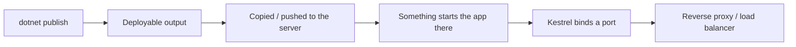

Step by step: a build/CI server runs `dotnet publish` (not `dotnet run`) to produce the deployable output — either a plain folder, or a container image if you're going that route. That artifact gets copied to the actual server (or pushed to a registry, for containers). Something on that server then *starts* the app as a running process — either by executing the apphost / `dotnet App.dll` directly, or by a container runtime starting a container from the image. At that point the app's own Kestrel is listening, exactly like it does locally, just on a real server instead of your laptop — and then it's section 8's job (reverse proxy, load balancer) to make that internet-reachable, instead of only reachable from `localhost`.

Worth stating outright: the server only ever needs that published output — the compiled DLLs, `.deps.json`, `.runtimeconfig.json`, and any config files. It never needs the `.cs` source files, the `.csproj`, or `bin`/`obj`'s intermediate build clutter. That's the entire point of compiling ahead of time: the published folder (or container image) is a self-sufficient artifact the runtime can execute on its own, and source code never needs to leave the development/CI environment.

## 4. From C# source code to a running application

The short version: source code compiles into IL, IL gets packaged into a file called an assembly, and the runtime loads and executes that assembly.

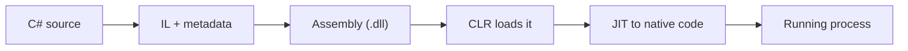

The step that's easy to skip over mentally is the middle one: going from **"IL + metadata"** to **"Assembly (.dll)"** in the diagram above. The compiler's real output is IL plus metadata, not a `.dll` by itself. That IL and metadata then get packaged into a file using the **PE (Portable Executable) format** — and *that* packaged file is what we call the assembly, the `.dll`. So "compiling to a DLL" is really "compiling to IL, then packaging the IL into a DLL-shaped container." Section 3.1 has the fuller breakdown of these same three things side by side.

A **DLL** in .NET is that assembly — a compiled unit bundling IL code, metadata describing its types, and a manifest listing which other assemblies it depends on.

Alongside that DLL, a build also produces a small native launcher — commonly called the **apphost**. Its only job is to find an installed .NET runtime and tell it to load and run the app's DLL, which is why you can run `./MyApp` directly instead of typing `dotnet MyApp.dll` yourself. Sections 4.1 and 4.2 below show this for real and go deeper on what it actually is.

### 4.1 A worked example: one file, three stages

To make this concrete instead of abstract, I actually built this (as a throwaway scratch project, not part of this repo) while writing this section, rather than guess at the output.

```csharp
// Program.cs
Console.WriteLine("Hello from Day 0");
```

Running `dotnet build` on that one file, then looking inside `bin/Debug/net10.0/`, produced exactly this (real output from my machine, macOS/Arm):

```text
bin/Debug/net10.0/
├── HelloDay0                       # the apphost (defined above) — no extension on macOS/Linux
├── HelloDay0.dll                   # the assembly: IL + metadata, packaged in PE format
├── HelloDay0.deps.json             # lists the app's runtime dependencies
├── HelloDay0.pdb                   # debug symbols (used for stack traces / breakpoints)
└── HelloDay0.runtimeconfig.json    # which .NET version/runtime this app targets
```

The genuinely useful bit: I ran the Unix `file` command against both binaries to see what they actually *are* at the file-format level:

```text
HelloDay0:     Mach-O 64-bit executable arm64
HelloDay0.dll: PE32 executable (console) Intel 80386 Mono/.Net assembly, for MS Windows
```

`HelloDay0` (the apphost) is a real native macOS binary (Mach-O). But `HelloDay0.dll` reports itself as a **Windows PE32 executable** — even though it was built and will run on a Mac. That's not a bug; it's the point of the assembly format: the `.dll` container is the *same* PE-based format on every OS, because it only needs to be understood by the CLR (which knows how to read PE files everywhere), never by the host OS's own loader. The apphost, by contrast, genuinely is OS-specific, because *it* is what the OS itself has to be able to launch directly.

### 4.2 DLL vs EXE, and where each one comes from

On modern SDKs, the apphost is produced automatically, right alongside the DLL, from a plain `dotnet build` — not just from publishing. That's what the file listing in 4.1 shows: `HelloDay0` and `HelloDay0.dll` were both sitting in `bin/Debug/net10.0/` after nothing more than `dotnet build`.

- **On Windows**, the apphost is named `<AppName>.exe`.
- **On macOS/Linux**, there's no `.exe` extension — it's just `<AppName>`, with no extension at all. It's still a genuine native binary (Mach-O on macOS, ELF on Linux); the *alternative* to a `.exe` on non-Windows platforms is simply an extension-less native executable playing the same role.

All the real application logic still lives in the DLL — the apphost's only job (as introduced in section 4 above) is to locate a matching installed .NET runtime, start it, and tell it to load this app's `.dll`. It exists purely for convenience.

One more distinction worth knowing, expanded fully in section 3.3: `dotnet build` output (`bin/Debug/<tfm>/`, as above) is meant for local development. `dotnet publish` output (`bin/Release/<tfm>/publish/` by default) is the one meant for actual deployment.

> **Verification exercise (do this after Day 2, once a project exists):**
> Run `dotnet build`, then look inside `bin/Debug/<target-framework>/` (e.g. `bin/Debug/net10.0/`, or whatever version is installed) — compare it against the file listing in section 4.1 above. Identify the application's own DLL, the dependency DLLs it references, and the apphost — then check what `file` (macOS/Linux) or a similar tool reports it as.

## 5. What kinds of applications can .NET build?

.NET is a general-purpose platform — ASP.NET Core (web APIs) is just one of several app stacks built on it:

| Application type | What it's for |
|---|---|
| Console app | Command-line tools and scripts |
| Class library | Reusable code shared across other .NET projects |
| ASP.NET Core web app / API | Web sites and HTTP APIs — what this repository focuses on |
| Worker service | Long-running background processes (queues, scheduled jobs) |
| Desktop app (WPF / Windows Forms) | Windows desktop applications |
| Mobile / cross-platform app (.NET MAUI) | iOS, Android, and desktop apps from one codebase |
| Game development (Unity) | Games, using C# as the scripting language over the Unity engine |

Everything from here on focuses specifically on **ASP.NET Core Web APIs**, since that's the application type this repository builds toward.

## 6. What is an API?

In plain terms: an **API (Application Programming Interface)** is a defined way for one piece of software to ask another piece of software to do something or return some data, without needing to know how that other piece is implemented internally.

A **Web API** is an API exposed over HTTP: a server listens for HTTP requests, and clients (browsers, mobile apps, other services, `curl`, a React frontend) send requests to it and get back responses — commonly formatted as JSON.

Concrete example: a React frontend needs a user's task list, so it sends:

```text
GET /api/tasks
```

The API receives that request, looks up the tasks (probably from a database), and responds with something like:

```json
[
  { "id": 1, "title": "Write Day 1 notes", "done": true },
  { "id": 2, "title": "Scaffold the API project", "done": false }
]
```

The React app never needs to know how the server fetched that data — just the contract: send a `GET` to `/api/tasks`, get JSON back.

### 6.1 A non-web API, for contrast

"API" is a broader idea than "Web API" — it's easy to lose sight of that when everything I build day-to-day happens to be a web API. Here's one with no HTTP involved at all: .NET's own file-system library.

```csharp
string content = File.ReadAllText("notes.txt");
```

`File.ReadAllText` is an API — a defined way to ask "read this file's contents for me" without needing to know how it opens file handles, reads bytes off disk, or decodes them into a string. Same definition of "API" as section 6's opening line. What's different from the Web API example above is entirely about *where* the call happens: `File.ReadAllText` runs as a plain method call inside the same process that calls it — no network, no client/server split, no serialization to JSON. The `GET /api/tasks` example crosses a real boundary between two separate running processes, which is exactly why it needs HTTP as a shared protocol in the first place. (The Win32 API and the POSIX API are two more well-known non-web examples — defined sets of functions an OS exposes for programs to call directly, in-process, no network involved.)

## 7. HTTP fundamentals

A few pieces come up in almost every API interaction:

- **URL** — the address of a resource, e.g. `https://api.example.com/api/tasks/2`.
- **HTTP method** — what kind of action the request represents:
  - `GET` — retrieve a resource
  - `POST` — create a resource
  - `PUT` — replace a resource
  - `PATCH` — partially update a resource
  - `DELETE` — remove a resource
- **Headers** — key/value metadata sent with the request or response (e.g. `Content-Type`, `Authorization`).
- **Body** — the payload of the request or response (often JSON for APIs).
- **Status code** — a three-digit number in the response indicating the outcome (`200` OK, `201` Created, `400` Bad Request, `401` Unauthorized, `404` Not Found, `500` Internal Server Error).
- **JSON** — the common text format for structuring request/response bodies in modern web APIs.
- **Port** — the numeric endpoint a server listens on for a given host (e.g. `:443` for HTTPS, `:5001` for a local dev API).
- **HTTPS vs HTTP** — HTTPS is HTTP layered over TLS, encrypting traffic between client and server. Plain HTTP sends everything in the clear. Production APIs should use HTTPS; ASP.NET Core's local dev templates set up HTTPS by default even for `localhost`.

An annotated request/response pair for the example above:

```text
GET /api/tasks/2 HTTP/1.1          ← method, path, HTTP version
Host: api.example.com              ← which server to route to
Accept: application/json           ← "I want JSON back"
Authorization: Bearer <token>      ← auth credential, if required
```

```text
HTTP/1.1 200 OK                    ← status line: success
Content-Type: application/json     ← body format

{
  "id": 2,
  "title": "Scaffold the API project",
  "done": false
}
```

**Not runnable yet — this needs an actual running API (Day 2+):**

```bash
curl -i https://localhost:5001/api/tasks
```

`-i` includes the response headers and status line, which is useful for seeing exactly what came back, not just the body.

### 7.1 Why HTTPS needs a certificate

Start from the actual problem, not the solution. Plain HTTP (no "S") is just: open a raw TCP connection to a server, and start sending plain-text HTTP messages over it. That has two real weaknesses:

1. **No privacy.** Anything sent in plain text can be read by anything sitting between you and the server — your Wi-Fi router, your ISP, a compromised network hop. There's no scrambling of any kind.
2. **No identity check.** Your browser has no built-in way to confirm the machine that answered on the other end of that TCP connection is actually the real `api.example.com`, and not something else that happened to intercept the connection (a "man in the middle").

HTTPS is HTTP run over an extra layer, TLS, and TLS is specifically what solves both problems — but to encrypt a conversation *and* prove identity, TLS needs some piece of trusted evidence to build on, and that evidence is the certificate. So the certificate isn't "proof a domain is registered so nobody else can host there" (that's DNS's job, and DNS alone doesn't stop impersonation) — it's closer to: **cryptographic proof, checked by your browser, that the entity on the other end holds the specific private key matching a certificate that some already-trusted third party (a Certificate Authority) issued specifically for this domain name.** An attacker can absolutely stand up a server and claim to be your bank; what they can't do is produce a certificate for your bank's real domain signed by a CA your browser already trusts, because CAs only issue one after verifying the requester actually controls that domain.

Once the browser is satisfied the certificate checks out, that same certificate also hands over the key material used to set up the encrypted channel for the rest of the conversation — solving problem #1 too, as a side effect of solving #2.

**Certificates expire on purpose.** An expired certificate is like an ID card past its expiry date — the issuer is no longer actively vouching for it, even if the underlying keys technically still work. That's exactly what the "certificate expired" browser warning means: the identity claim had a "valid until" date, and it's passed.

**For local development**, ASP.NET Core ships a self-signed local dev certificate so `https://localhost:5001` works without buying a real one. It isn't trusted by your OS automatically — you have to say so explicitly, once:

```bash
dotnet dev-certs https --trust
```

In production, you need a real certificate issued by a trusted CA for your actual domain. In most real deployments, that certificate lives on whatever is doing TLS termination — the reverse proxy or cloud load balancer covered in section 8 — rather than on Kestrel itself, which is one more reason that layer exists.

## 8. What is a .NET server?

Quick disambiguation before anything else, because "server" gets overloaded three different ways in casual conversation:

| Sense of "server" | Example |
|---|---|
| A physical/virtual machine | "the server in AWS" |
| A running process providing some service | "the database server" |
| Specifically, a process that handles HTTP requests | "the .NET server" — this section |

"A .NET server," in that third sense, isn't a separate product you install — it usually just means **a running ASP.NET Core application process that is listening for HTTP requests**. The "server" is the app itself, plus the web server component embedded in it. So yes — in this specific sense, "server" *is* directly tied to handling HTTP; that's the meaning this whole section uses.

**One naming detour, since it comes up constantly:** ".NET Framework" was the original, Windows-only .NET (2002), still supported but in maintenance, not actively evolved. ".NET Core" was the cross-platform rebuild, started 2016. Starting at version 5 (2020), Microsoft dropped the word "Core" and just called it **.NET** — so ".NET Core" and modern ".NET" (5, 6, 7 … 10) are the same lineage, just a rebrand partway through; ".NET Framework" is the older, separate thing. Everything in this repo is modern .NET.

### 8.1 HTTP rides on top of TCP

This is the piece that kept feeling contradictory until I drew it as layers instead of a single word: **HTTP and TCP are not two competing things — HTTP is built on top of TCP.**

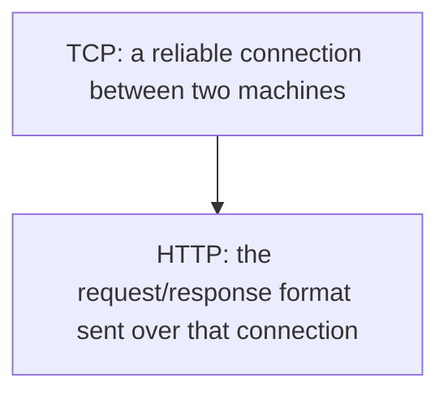

TCP's only job is moving raw bytes reliably between two machines, in order, without you having to think about packet loss or retransmission — it knows nothing about "GET," "headers," or "JSON." HTTP is a *text format* layered on top: once a TCP connection exists, HTTP defines what the bytes flowing over it mean (a method, a path, headers, a body). So "listening for HTTP requests" is always, underneath, "listening for TCP connections, then interpreting the bytes that arrive on them as HTTP."

Concretely, at the OS level: a process that "listens" has asked the OS to reserve a port (say, `5001`) and told it *"whenever a new TCP connection arrives here, hand it to me"* — a socket **bind** followed by a **listen**, standard OS networking, not .NET-specific. Once a connection actually arrives, the process **accepts** it, reads the raw bytes coming in, and parses them according to the HTTP spec — pulling out the method, path, headers, and body from section 7. Kestrel (next section) is the piece of ASP.NET Core that does exactly this.

Two lower-level alternatives, worth knowing exist even though you won't touch them directly: **`HttpListener`**, an older, lower-level .NET class that does the same bind-and-parse job at a smaller scale (not what ASP.NET Core uses internally); and **HTTP.sys**, a Windows *kernel-mode* HTTP listener that IIS uses, and that Kestrel can optionally use instead of its default listener on Windows.

### 8.2 Kestrel, in one sentence first

**Kestrel is the piece of code, running inside your own app's process, that does the listening from 8.1 and turns raw TCP bytes into an HTTP request object your code can work with.** It's not a separate product to install — it's a library, included by default in every ASP.NET Core project, and the same Kestrel code runs unmodified on Windows, macOS, and Linux.

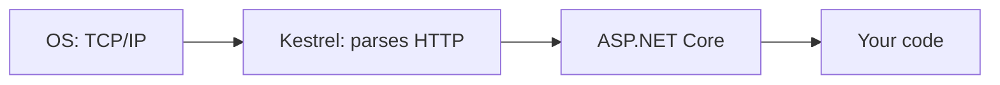

The response travels back out through that same chain in reverse — Kestrel is what actually writes the response bytes back onto the TCP connection.

Kestrel deliberately knows nothing about routes, authentication, or your business logic — it only handles the raw HTTP mechanics. Everything above that (middleware, routing, dependency injection) is the ASP.NET Core layer sitting on top of it, which section 10.1 maps out in full. Kestrel is hardened enough to be used directly, facing the public internet, in a modern deployment — but it's still extremely common to put something in front of it, covered next.

### 8.3 Reverse proxies: the simple picture, then Nginx and IIS

**The simple picture first:** a reverse proxy is just something that sits between the internet and Kestrel, so clients talk to *it* instead of talking to Kestrel directly.

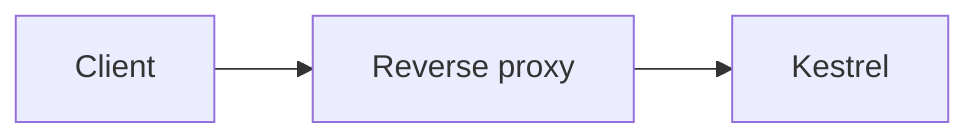

That's the entire idea. Everything below is *why* you'd want that extra hop, and which real products play that role.

**Why put one in front of Kestrel at all?** A few concrete, recurring reasons:

- **TLS termination** — the proxy holds the real, CA-issued certificate (section 7.1) and decrypts HTTPS traffic; it then talks to Kestrel over plain HTTP, but only over `localhost` or a private network. Certificate management lives in one place instead of on every app instance.
- **Sharing one public port across many apps** — only one process can bind port 443 at a time; the proxy listens there and routes to whichever backend app a given hostname or path belongs to.
- **Buffering and shielding against slow or abusive clients** — connection limits and basic filtering happen before load reaches your app process.
- **Static files, caching, compression, centralized logging** — often cheaper to handle once at the proxy layer than inside every app instance.

**Nginx** is an open-source, high-performance web server, very commonly used as a reverse proxy on Linux. In front of an ASP.NET Core app, Nginx listens on the public port (typically 443), terminates TLS, and forwards each request to Kestrel over `localhost` (e.g. `http://127.0.0.1:5000`). Because Nginx's own connection to Kestrel replaces the original client's IP and protocol info, it adds `X-Forwarded-For` and `X-Forwarded-Proto` headers carrying the *real* original client IP and whether the original request was HTTPS — which ASP.NET Core's **Forwarded Headers Middleware** reads back out.

**IIS (Internet Information Services)** is Microsoft's web server for Windows Server — what "classic" (pre-Core) ASP.NET ran inside directly. For ASP.NET Core, IIS can host an app two ways: **out-of-process** (IIS behaves exactly like Nginx above — a reverse proxy forwarding to a separate Kestrel process via the ASP.NET Core Module), or **in-process** (the modern default — the app runs *inside* IIS's own worker process directly, using an IIS-native listener instead of Kestrel at all, for better performance on Windows).

Whichever one — Nginx, IIS-out-of-process, or anything else playing this role — they all share the same shape from the diagram above: *public-facing listener → forwards to → app*.

### 8.4 Cloud load balancers

A load balancer solves a related but different problem: instead of forwarding to *one* known backend, it distributes traffic across *many identical instances* of your app, so no single instance gets overwhelmed and the app survives any one instance crashing.

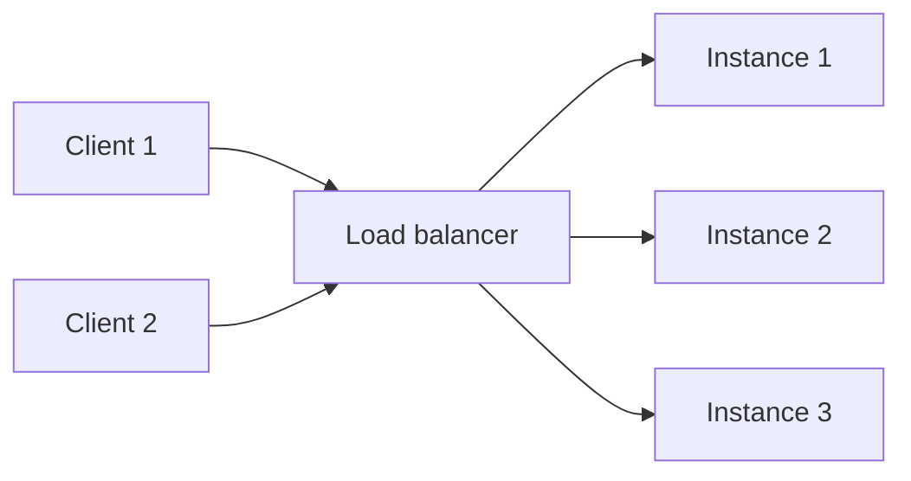

A cloud load balancer (AWS Application Load Balancer, Azure Load Balancer, a Kubernetes Ingress) very often does TLS termination too, exactly like a reverse proxy, and forwards the same `X-Forwarded-*` headers. The conceptual difference: a reverse proxy fans a request to *one* known backend; a load balancer *chooses which of several* identical backends handles this particular request. In real deployments these roles frequently overlap — one piece of infrastructure often does both jobs at once.

### 8.5 Putting it together

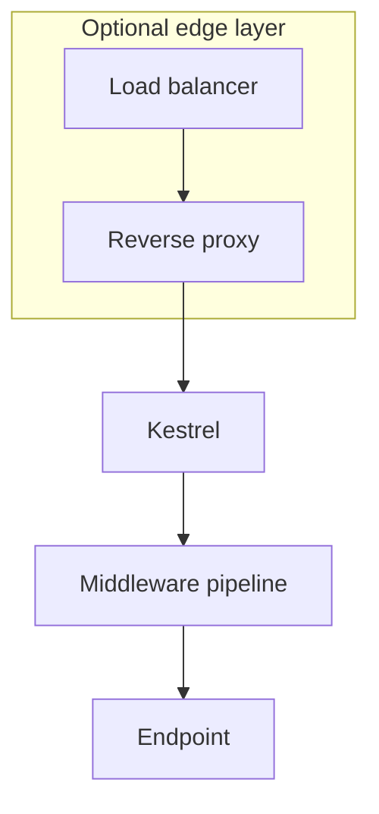

Not every deployment has every layer. A small side project might run Kestrel directly on a cloud VM, listening on its own port with nothing in front of it. A typical company deployment stacks a cloud load balancer, then a reverse proxy (Nginx or IIS), then Kestrel — each layer adding exactly one responsibility (distribute load; terminate TLS and route; parse HTTP and hand off to the app). Section 9 traces this same idea as one request's actual journey, including what's different for local development.

*How Kestrel decides what to do with a request once it has one — the middleware pipeline — is deliberately not covered here. That's Day 2.*

## 9. How an HTTP request reaches an ASP.NET Core API

The general path, including the pieces that may or may not be present depending on the deployment (see section 8 for what each of these actually is):

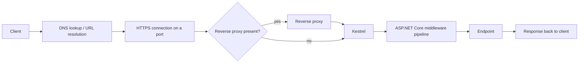

For **local development**, most of that collapses to a much shorter path — no DNS, no reverse proxy, just the loopback address straight to Kestrel:

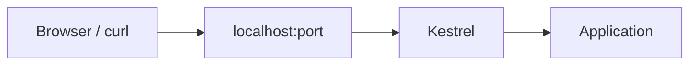

*The middleware pipeline and endpoint routing boxes above are placeholders for now — Day 2 opens them up and traces exactly what happens inside.*

## 10. What is ASP.NET Core, and how do we create a Web API?

**ASP.NET Core** is .NET's cross-platform, open-source framework for building web apps and APIs — it's what sits on top of Kestrel and everything else described above, providing routing, middleware, dependency injection, configuration, and the other pieces an API needs.

**Not run yet — this is the command that will scaffold the API in a later day:**

```bash
dotnet new webapi -n DotnetApiFundamentals.Api
```

At a high level, this command generates a new project directory containing:

- A project file (`.csproj`) describing the target framework and dependencies
- `Program.cs`, the application's entry point and configuration
- `appsettings.json` / `appsettings.Development.json` for configuration
- `Properties/launchSettings.json` describing how to run the app locally (ports, environment)
- A starter minimal-API endpoint to confirm the template runs

The same project can also be created through **Visual Studio** (File → New Project → ASP.NET Core Web API) or **VS Code** (via the same `dotnet new` command run from its integrated terminal, or the C# Dev Kit's project creation UI) — they all produce the same underlying template.

No generated project files are added to this repository as part of this document — that happens when the API is actually scaffolded.

### 10.1 Where routing, middleware, DI, and configuration sit on top of Kestrel

Section 8.2 said middleware, routing, and DI are "the ASP.NET Core layer on top of Kestrel" without saying how they actually get wired on top of it. The answer is the **.NET Generic Host**.

When a Web API's `Program.cs` calls `WebApplication.CreateBuilder(args)` and then `builder.Build()`, it's constructing a **host** — an object that owns and coordinates everything the app needs to run as one coherent process: configuration, the dependency injection container, logging, and — because this is a web app — the HTTP server itself. `CreateBuilder` registers Kestrel as "the thing that listens for HTTP" automatically, so Kestrel becomes just one more service the host starts and stops as part of the app's lifecycle.

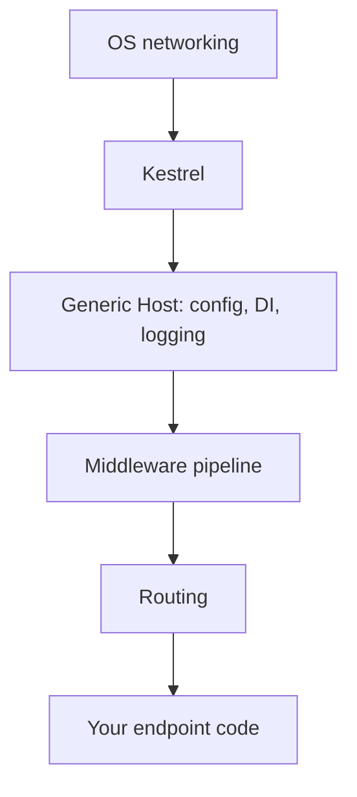

That diagram simplifies one thing worth flagging: configuration and DI aren't stages a request "passes through" in sequence the way middleware and routing genuinely are — they're infrastructure the host makes available continuously, which any layer can reach into at any point. Middleware and routing really are an ordered pipeline the request flows through one step at a time — which is exactly what Day 2 is for.

## 11. Understanding a Web API project structure

A freshly generated ASP.NET Core Web API project (this is the actual layout `dotnet new webapi` produces on the current SDK — I generated one as a scratch project to confirm, rather than go from memory):

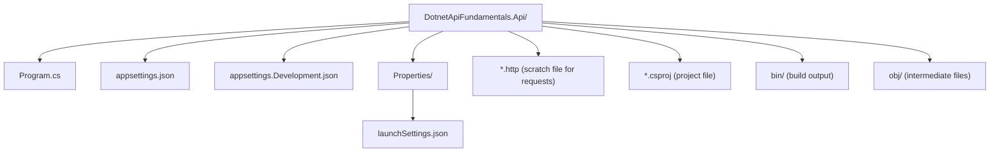

`bin/` and `obj/` are regenerated every time the project builds — they hold compiled output and intermediate build artifacts respectively, and belong in `.gitignore`, not in source control.

Beyond that starter layout, folder organization is flexible. A small API might keep everything in a handful of files; a larger one might grow `Models/`, `Services/`, `Data/` folders or a full layered structure. The template gives a starting point, not a mandate — structure should evolve as the application's actual complexity demands it, which section 12 gets into.

## 12. Minimal APIs, controllers, and architecture

These terms get conflated a lot, but they answer different questions:

| Concept | What it actually answers |
|---|---|
| **Minimal APIs** | *How do I define an endpoint?* — An ASP.NET Core style where routes and handlers are declared directly (often in `Program.cs` or via extension methods), without a controller class. |
| **Controllers** | *How do I define an endpoint?* — The MVC-style approach: endpoints are actions (methods) on controller classes, grouped by resource. |
| **Three-tier architecture** | *How is the whole application organized?* — A broad architectural split into presentation/API, business/application logic, and data access layers. |
| **Clean Architecture** | *How is the whole application organized?* — A related architectural approach emphasizing dependency direction (inner layers know nothing about outer ones) and clear domain boundaries. |
| **Design patterns** | *How do I solve this specific code-level problem?* — Reusable solutions to recurring design problems (e.g. Repository, Factory, Strategy). Not an application architecture by themselves. |

Minimal APIs and controllers are both just ways of *declaring endpoints* — they're an endpoint-definition style choice, not an architecture:

| | Minimal APIs | Controllers |
|---|---|---|
| Where endpoints live | `Program.cs` or extension methods | Controller classes with action methods |
| Typical use case | Small APIs, microservices, simpler surface area | Larger APIs, especially ones already using MVC conventions |
| Boilerplate | Less — no controller class required | More structure out of the box (attributes, base class helpers) |
| Filters / model binding / routing | Fully supported | Fully supported |
| Grouping related endpoints | `MapGroup` and extension methods | Naturally grouped by controller class |

Choosing Minimal APIs does **not** prevent using a layered or Clean Architecture underneath — the endpoint style and the application's internal structure are separate decisions. A Minimal API endpoint can still call into a well-separated service/business layer and a distinct data-access layer; it just skips the controller class as an organizing unit.

For this repository, the plan is to start with whatever's simplest (very likely Minimal APIs, since the template defaults to them) and introduce more structure only when a real complexity problem shows up — not preemptively.

## 13. Follow-up questions: TLS handshakes, reverse proxies, and load balancers

Section 7.1 and section 8 above cover *why* HTTPS needs a certificate and *why* you'd put a reverse proxy or load balancer in front of Kestrel. After writing those, I still had a handful of "okay, but concretely, how?" questions left over — so I took them to a separate chat, cross-checked the answers against the same Microsoft Learn docs cited in Sources, and I'm folding the useful parts back in here rather than leaving them scattered in a chat transcript.

### 13.1 The TLS handshake, step by step

Section 7.1 explains *why* a certificate is needed (identity + encryption) but skips over the actual sequence of messages. Written out as a handshake:

```text
Client                                          Server
  │                                               │
  │── "I want HTTPS for api.example.com" ───────>│
  │                                               │
  │<── Certificate: domain + public key ─────────│
  │                                               │
  │  Client checks the certificate:               │
  │  - domain name matches                        │
  │  - not expired                                │
  │  - issuing CA is trusted                      │
  │  - CA's signature is valid                    │
  │                                               │
  │── (proceeds only if all checks pass) ────────>│
  │                                               │
  │<── Server proves it holds the private key ───│
  │                                               │
  │<═══ Client and server derive session keys ══>│
  │                                               │
  │════ Encrypted HTTP requests/responses ═══════│
```

The step I'd been glossing over is **"server proves it holds the private key."** A certificate is public data — an attacker can copy a bank's real certificate byte-for-byte and hand it to a victim. What the attacker *can't* do is complete this next step: during the handshake, the genuine server performs a cryptographic operation using its private key (which never leaves the server), and the client verifies that operation using the public key already sitting inside the certificate it just received. Only the real holder of the private key can produce a valid result. That's the actual moment identity gets proven — the certificate alone is just the claim; this step is the proof.

Once identity is confirmed, the certificate has done its job. The client and server then derive **session keys** — temporary, symmetric keys used to encrypt the rest of the conversation efficiently, because asymmetric public/private-key operations are too slow to use for every byte of HTTP traffic. So the certificate's role is narrow and front-loaded: establish trust in the server's identity and its public key; everything encrypted afterward rides on the (cheaper) session keys instead.

### 13.2 Why the reverse proxy can't hand the connection off to Kestrel

Section 8.3 lists *reasons* to put a reverse proxy in front of Kestrel (TLS termination, sharing one public port, shielding against abusive clients, and so on) but doesn't say why the proxy has to stay involved for the *entire* request, rather than just the first one.

The answer is about which process owns the connection. When TLS termination happens at the proxy (section 8.3), the client's actual TCP connection and TLS session belong to the proxy — not to Kestrel. The client only ever completed a TLS handshake with the proxy; it never established anything with Kestrel directly, and Kestrel was never involved in that handshake at all. So the proxy can't just step aside after the first request and let the client talk to Kestrel directly for the rest — there is no existing client-to-Kestrel connection to hand things off to. For that to happen, the client would need to open a brand new TCP connection to Kestrel and perform a brand new TLS handshake with it — which means Kestrel would need to be publicly reachable and hold its own certificate, which defeats most of the reasons for having the proxy in the first place (centralized TLS, routing, rate limiting, hidden backends). This is why every single request in a proxied deployment flows through the proxy: it isn't a limitation, it's a direct consequence of *whose* TLS session the request is traveling over.

The connection from the proxy to Kestrel is a separate hop entirely — it can be plain HTTP inside a private network, or HTTPS again if the internal network itself isn't trusted.

### 13.3 Forward proxy vs. reverse proxy

Both are "a server that sits in the middle," which is exactly why the names get confused. The difference is *whose behalf* the proxy is acting on:

```text
Forward proxy — acts for the client:
  Client → Forward proxy → the open internet

Reverse proxy — acts for the server:
  Internet client → Reverse proxy → internal backend
```

A forward proxy is the client's proxy — a company's outbound web filter, for example, where the destination server has no idea a proxy is involved. A reverse proxy (Nginx/IIS in front of Kestrel, section 8.3) is the server's proxy — the client has no idea it isn't talking to the real backend directly.

### 13.4 Load-balancer strategies: it's not just RAM

Section 8.4 says a load balancer distributes traffic across instances, without saying *how* it picks one. I'd assumed it always checked something like memory usage — it doesn't have to. Common strategies:

| Strategy | How it picks an instance |
|---|---|
| **Round-robin** | Cycle through instances in order, one request each |
| **Least connections** | Send to whichever instance currently has the fewest active connections |
| **Health checks** | Skip instances that are failing or unresponsive, regardless of strategy otherwise used |
| **Weighted** | Send proportionally more traffic to stronger/larger instances |
| **Resource-aware** | Use live CPU, memory, or a custom metric to decide |

RAM usage *can* feed a resource-aware strategy, but it's one option among several, not the definition of load balancing. Round-robin is the simplest and the one the demo in 13.5 actually uses.

### 13.5 Try it yourself: two Kestrel instances behind Nginx

The best way to stop treating "reverse proxy" and "load balancer" as abstract boxes in a diagram is to actually run two API instances behind Nginx and watch requests alternate between them. I built exactly that as a small supporting project — [`examples/day-01-nginx-load-balancing/`](../examples/day-01-nginx-load-balancing/) — rather than only describe it:

```text
curl
  ↓
Nginx  (listens on :8080, round-robins)
  ├──→ Kestrel instance A (:5001)
  └──→ Kestrel instance B (:5002)
```

Both instances run the exact same Minimal API; an environment variable tells each one its own name, and the single endpoint just echoes it back. See that folder's own README for the exact commands. Running it for real, with Nginx actually round-robining between both instances:

```text
$ for i in 1 2 3 4 5 6; do curl -s http://localhost:8080/; echo; done
{"instance":"A","port":5001,"time":"2026-09-14T07:42:00.4414670Z"}
{"instance":"B","port":5002,"time":"2026-09-14T07:42:00.4536990Z"}
{"instance":"A","port":5001,"time":"2026-09-14T07:42:00.4615560Z"}
{"instance":"B","port":5002,"time":"2026-09-14T07:42:00.4673720Z"}
{"instance":"A","port":5001,"time":"2026-09-14T07:42:00.4734420Z"}
{"instance":"B","port":5002,"time":"2026-09-14T07:42:00.4789500Z"}
```

That alternation is round-robin load balancing, observed directly rather than assumed. The next step, not done yet, is adding a local certificate to Nginx and watching TLS termination happen the same way — the mechanics from section 13.1, this time in front of a real reverse proxy instead of just a client and one server.

## 14. What we will verify in this repository

This document is notes and definitions — the following is what still needs to be checked hands-on. Some of it is already done, as part of Day 1:

- [x] Run two Kestrel instances behind Nginx and observe round-robin load balancing (section 13.5, `examples/day-01-nginx-load-balancing/`)
- [ ] Inspect the generated DLL(s) after `dotnet build` and identify app vs. dependency DLLs
- [ ] Send real HTTP requests to a running API using `curl` or a REST client
- [ ] Observe the local port and running process for the API
- [ ] Run a middleware experiment (Day 2)
- [ ] Inspect application logs
- [ ] Write tests that actually prove the described behavior, rather than just asserting it here

## 15. What comes next

[Day 2](day-02-request-pipeline-and-middleware.md) will trace a request through the ASP.NET Core middleware pipeline — the part of section 9's diagram left as a placeholder.

---

## Sources

- [Introduction to .NET](https://learn.microsoft.com/en-us/dotnet/core/introduction) — what .NET is, its components, and the .NET (Core) vs. .NET Framework naming history
- [C# documentation](https://learn.microsoft.com/en-us/dotnet/csharp/) — the C# language
- [Overview of ASP.NET Core](https://learn.microsoft.com/en-us/aspnet/core/introduction-to-aspnet-core) — what ASP.NET Core is and its key features
- [.NET CLI overview](https://learn.microsoft.com/en-us/dotnet/core/tools/) — the `dotnet` command-line tooling
- [Install .NET on Windows](https://learn.microsoft.com/en-us/dotnet/core/install/windows) — the separate Runtime vs. SDK installers, and what each includes
- [Assemblies in .NET](https://learn.microsoft.com/en-us/dotnet/standard/assembly/) — what an assembly/DLL is
- [Managed Execution Process](https://learn.microsoft.com/en-us/dotnet/standard/managed-execution-process) — compiling to IL, JIT compilation, code verification
- [.NET application publishing overview](https://learn.microsoft.com/en-us/dotnet/core/deploying/) — self-contained vs. framework-dependent vs. container deployment
- [Enforce HTTPS in ASP.NET Core](https://learn.microsoft.com/en-us/aspnet/core/security/enforcing-ssl) — TLS certificates and the local dev certificate
- [Kestrel web server in ASP.NET Core](https://learn.microsoft.com/en-us/aspnet/core/fundamentals/servers/kestrel) — the embedded cross-platform web server
- [Host ASP.NET Core on Windows with IIS](https://learn.microsoft.com/en-us/aspnet/core/host-and-deploy/iis/) — in-process vs. out-of-process hosting
- [Host ASP.NET Core on Linux with Nginx](https://learn.microsoft.com/en-us/aspnet/core/host-and-deploy/linux-nginx) — Nginx as a reverse proxy in front of Kestrel
- [Configure ASP.NET Core to work with proxy servers and load balancers](https://learn.microsoft.com/en-us/aspnet/core/host-and-deploy/proxy-load-balancer) — forwarded headers, `X-Forwarded-For`/`X-Forwarded-Proto`
- [.NET Generic Host in ASP.NET Core](https://learn.microsoft.com/en-us/aspnet/core/fundamentals/host/generic-host) — how DI, configuration, logging, and Kestrel are wired together
- [ASP.NET Core Middleware](https://learn.microsoft.com/en-us/aspnet/core/fundamentals/middleware/) — the pipeline covered in depth on Day 2
- [Tutorial: Create a minimal API with ASP.NET Core](https://learn.microsoft.com/en-us/aspnet/core/tutorials/min-web-api) — `dotnet new webapi` and Minimal APIs
- [Handle requests with controllers in ASP.NET Core MVC](https://learn.microsoft.com/en-us/aspnet/core/mvc/controllers/actions) — the controller-based alternative
- [HTTP request and response messages in ASP.NET Core web APIs](https://learn.microsoft.com/en-us/aspnet/core/web-api/) — HTTP fundamentals in an ASP.NET Core context
